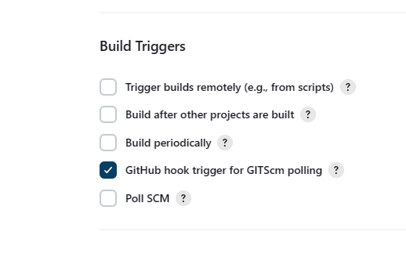

# JenkinsCICD
## An explanation:

## To set up the SSH:

## the public key is the one that goes on github, you print it and enter it into the field, rememeber to check that no extra spaces where carried accidently allong with them.

## Now to test sendind data , In an empty repo with no files you can follow the rules shown by github on the main page to add your changes to the repo
## remember to switch to SSH from HTTPS


# CICD
## continuous integration and continuous delivery/continuous deployment.
## Automated build-and-test steps triggered by CI ensure that code changes being merged into the repository are reliable. The code is then delivered quickly and seamlessly as a part of the CD process. In the software world, the CI/CD pipeline refers to the automation that enables incremental code changes from developers’ desktops to be delivered quickly and reliably to production.
## CI/CD allows organizations to ship software quickly and efficiently. CI/CD facilitates an effective process for getting products to market faster than ever before, continuously delivering code into production, and ensuring an ongoing flow of new features and bug fixes via the most efficient delivery method. 

# cde
Time for Continuous Deployment (CDE)

This approach also removes isolation in feature development, cuts down integration costs, helps quickly discover conflicts, promotes timely feedback, and maintains overall alignment with functionality.
# cd
Continuous Delivery is the ability to get changes of all types—including new features, configuration changes, bug fixes and experiments—into production, or into the hands of users, safely and quickly in a sustainable way.
# Jenkins
Jenkins is a Java-based open-source automation platform with plugins designed for continuous integration and deployment. It is used to continually create and test software projects, making it easier for developers and DevOps engineers to integrate changes to the project and for consumers to get a new build
## benefits
Jenkins offers many benefits for implementing CI/CD in IT operations management, such as flexibility, scalability, reliability, security, and collaboration. It is highly customizable, with hundreds of plugins that extend its functionality and compatibility with various tools and technologies.
## alternatives
- CircleCI.
- GitLab CI.
- GitHub Actions.
- Atlassian Bamboo.
- JetBrains TeamCity.
- Buildkite.
# pipelines

- Execute this Pipeline or any of its stages, on any available agent.
- Defines the "Build" stage.
- Perform some steps related to the "Build" stage.
- Defines the "Test" stage.
- Perform some steps related to the "Test" stage.
- Defines the "Deploy" stage.
- Perform some steps related to the "Deploy" stage.
## Why pipelines
- Code: Pipelines are implemented in code and typically checked into source control, giving teams the ability to edit, review, and iterate upon their delivery pipeline.

- Durable: Pipelines can survive both planned and unplanned restarts of the Jenkins controller.

- Pausable: Pipelines can optionally stop and wait for human input or approval before continuing the Pipeline run.

- Versatile: Pipelines support complex real-world CD requirements, including the ability to fork/join, loop, and perform work in parallel.

- Extensible: The Pipeline plugin supports custom extensions to its DSL [1] and multiple options for integration with other plugins.

# CICD diagram 

## CICD explenation


## Our CICD pipeline

## Our CICD in Jenkins
For a complex pipeline, stage 1 - jobs within pipeline, the stage  and some other jobs, 1 2 and 3. and so on. As many stages and jobs as necesary for a pipeline.

## Jobs
steps
- git push
- webhook
- jenkins
- master node
- agent node
- jobs
you need to wait for a master ndoe to spin up an agent VM
If a job freezez up thats fine, but if you run jobs on the amster node, the master node will be frozer,it will be down, much better to make runner nodes to run the jobs. 
Jenkins needs the private key.

# Set up
- use ssh
- set up the branch
- set up access to the github repositoy

# first create new key pair
## add to a repo not account

# use jenkins
## go to url
## go to new items

# create freestyle project

## add executable script

## you can also link another job

## you can run them and configure by selecting them


# from here you can configure so change the sheel executable command or link another job
## here you can also check the output 


## you can delete and create new ones quite intuitively
# Create jobs, job 1
## remember to limit vm's

## arange source code managment, user private key, incldue the headers at top and bottom

## need maven plug in to use maven, package recompiles and then test rusn the tests

## encoutered a blocker of the vm's being at capacity and not being able to run the jobs
## re configured and fixed by runnign the individualy on other vm's
## additionaly add the url of your guthub under the gegenral section where you limit vm's

## its the https not shh this time
## Here we set up webhook listening

## specify branch any

## add webhook to github

## creating job, job 2 works

## you need a merge before build and a git publisher plugin.


# build job 3

## script without testing

## adding tech242 pem file


## correct scp commands

## changes made when pushed to dev


## blockers were not beign able to make the command when using shh agent,
## the slution was : ```-o StrictHostKeyChecking=no ```