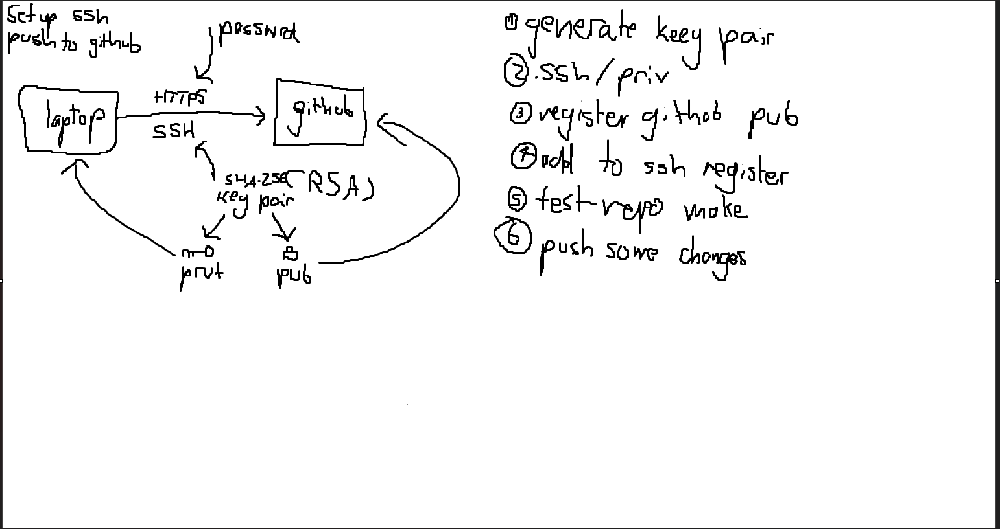

# JenkinsCICD
## An explanation:

## To set up the SSH:

## the public key is the one that goes on github, you print it and enter it into the field, rememeber to check that no extra spaces where carried accidently allong with them.

## Now to test sendind data , In an empty repo with no files you can follow the rules shown by github on the main page to add your changes to the repo
## remember to switch to SSH from HTTPS

